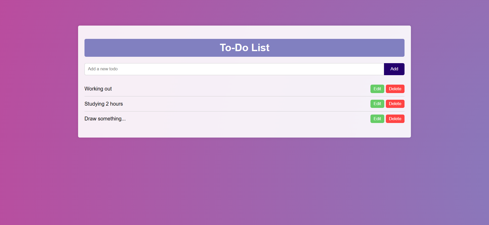

# To-Do App

This is a basic to-do list application built with vanilla JavaScript, CSS, and HTML. The purpose of this project was to practice fundamental web development skills using simple technologies without any external libraries or frameworks.

## Features

- Add tasks to the to-do list
- Edit task
- Delete tasks from the list
- Simple user interface styled with CSS

### Prerequisites

To run this project, you just need a web browser.

### Usage

1. Type a task in the input field and click "Add" to add it to the list.
2. Click on a task to edit.
3. Click the "Delete" button to remove the task from the list.

## Technologies Used

-  : For the structure of the application
-  : For basic styling of the app
-  : For functionality, including adding, deleting, and marking tasks as completed

## Why This Project?

This project was a practice exercise to improve my understanding of basic web development concepts using plain JavaScript, CSS, and HTML. The goal was to create a simple, interactive application without relying on any frameworks or libraries.

## What I Learned

- Manipulating the DOM using JavaScript
- Handling user events, such as clicks
- Working with basic HTML and CSS for structuring and styling the application
- Implementing simple JavaScript logic for adding, deleting, and updating tasks

## Screenshot

## Future Improvements

- Add local storage to save tasks even when the page is refreshed
- Implement task editing functionality
- Improve the user interface with more advanced styling

## Contact

For more details feel free to contact me.
